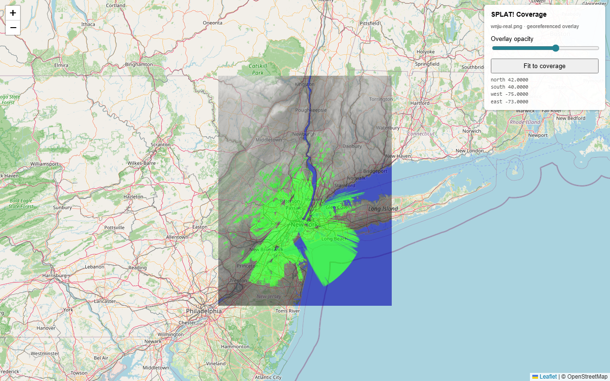

# SPLAT! web viewer

A tiny browser viewer that overlays SPLAT!'s coverage maps on an
OpenStreetMap basemap, geographically anchored using the `.geo` sidecar
SPLAT! already emits.



*30-mile line-of-sight coverage from WNJU-DT (40.8°N, 74.25°W) over real
1-arc-second SRTM elevation data. The coverage shape is irregular because
the Watchung ridges to the west shadow the signal; the river valleys carry
it further than the surrounding hills do.*

## What you get

- **OSM basemap** under your coverage data, so you can see exactly where
  the signal goes versus the actual coastline / roads / cities.
- An **opacity slider** to fade between the coverage overlay and the map.
- A **"Fit to coverage" button** that snaps the viewport to the analysis
  region.
- The parsed bounds (north/south/east/west) shown in the side panel as a
  sanity check.

## Quick start

```powershell
# 1. Generate a coverage PNG + the .geo sidecar (the -geo flag is what
#    produces the sidecar; the .png extension picks the new PNG writer).
splat -t wnju-dt.qth -c 30 -metric -geo -o coverage.png

# 2. Launch the viewer (opens http://localhost:8765/?name=coverage and
#    your default browser).
../viewer/launch.ps1 coverage
```

That's it. Ctrl+C in the launch.ps1 window stops the server and cleans
up its temp dir.

## End-to-end with real SRTM terrain

The hero shot above was produced by this pipeline:

```powershell
# 0. One-time: build srtm2sdf-hd (the HD SRTM converter).
cmake -S . -B C:\splat-build -G "Visual Studio 17 2022" -A x64 -DSPLAT_BUILD_UTILS=ON
cmake --build C:\splat-build --config Release --target srtm2sdf-hd

# 0. One-time: build an HD splat (-DSPLAT_HD_MODE=1, in a separate build dir
#    so the std-res splat + its baselines stay intact).
cmake -S . -B C:\splat-build-hd -G "Visual Studio 17 2022" -A x64 `
      -DSPLAT_HD_MODE=1 -DSPLAT_MAXPAGES=4

# 1. Fetch + convert the 4 SRTM tiles around WNJU-DT (40-41N x 73-74W
#    SW-corner range -> covers 40-42N x 73-75W in 4 tiles, ~30 MB total).
mkdir C:\splat-work; cd C:\splat-work
copy ..\sample_data\wnju-dt.qth .
copy ..\sample_data\wnju-dt.lrp .
..\utils\fetch_srtm.ps1 -MinLat 40 -MaxLat 41 -MinWest 74 -MaxWest 75

# 2. Run an HD coverage analysis (1-arc-second resolution -> 7200x7200 image).
C:\splat-build-hd\Release\splat-hd.exe `
    -t wnju-dt.qth -c 30 -metric -geo -o wnju-real.png

# 3. View it.
..\viewer\launch.ps1 wnju-real
```

`fetch_srtm.ps1` pulls from ESA's public SRTMGL1 mirror (no auth, ~1.8 MB
per 1-arc-second tile), unzips, and runs `srtm2sdf-hd` on each `.hgt` to
produce the `<lat>_<lat+1>_<west>_<west+1>-hd.sdf` files SPLAT! HD reads.
Ocean tiles 404 from ESA and are skipped automatically.

## How it works (no magic)

`launch.ps1` stages `<name>.png`, `<name>.geo`, and `viewer/index.html`
into a temp directory, then starts a tiny .NET `HttpListener` on
`http://localhost:<port>/` (default 8765). No admin needed -- localhost
binding doesn't require URL ACL reservations.

`index.html` is a single-page Leaflet app that:
1. Loads Leaflet from unpkg CDN.
2. Adds the OpenStreetMap tile layer as a basemap.
3. `fetch()`es `<name>.geo` and parses its two `TIEPOINT` lines for the
   bounding-box corners.
4. Adds the PNG as an `L.imageOverlay` over those bounds.
5. Fits the viewport, wires the opacity slider, done.

The same file works for any SPLAT! map -- `?name=foo` loads `foo.png`
and `foo.geo`.

## Options

```powershell
launch.ps1 coverage                   # default: -SourceDir . -Port 8765
launch.ps1 coverage -Port 9000        # different port
launch.ps1 coverage -SourceDir ..\work
launch.ps1 coverage -NoBrowser        # don't auto-open browser
```

## Notes

- The CDN load requires internet on first launch. If you need offline,
  download `leaflet.css` and `leaflet.js` from unpkg.com/leaflet@1.9.4
  alongside `index.html` and adjust the `<link>`/`<script>` URLs.
- Leaflet's `imageOverlay` reprojects on-the-fly between the source
  WGS-84 coordinates and the basemap's Web Mercator projection -- the
  alignment is correct but the overlay stretches slightly toward the
  poles, matching every other lat/lon raster in a slippy map.
- For a more polished UX you can swap the OSM tile layer for any other
  basemap (Mapbox, Esri World Imagery, Carto Voyager, ...). One line.
- This viewer reads the `.geo` sidecar, not the GeoTIFF. Loading
  GeoTIFF directly in the browser is possible via
  [`leaflet-geotiff-2`](https://github.com/danwild/leaflet-geotiff)
  or [`georaster-layer-for-leaflet`](https://github.com/GeoTIFF/georaster-layer-for-leaflet)
  if you'd rather skip the sidecar.
