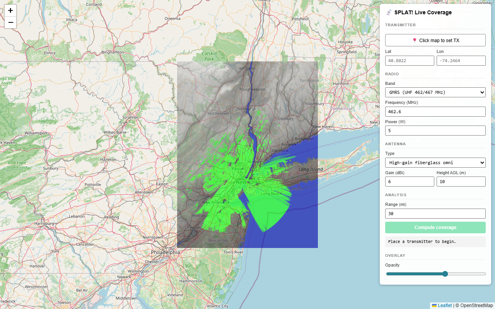
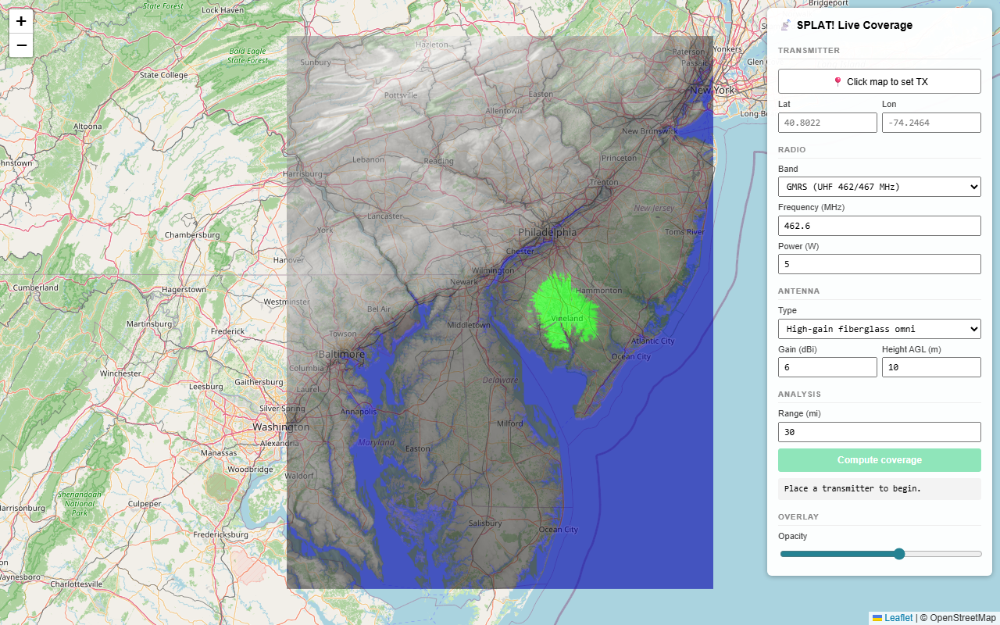

# SPLAT! interactive web viewer

A browser front-end for SPLAT!: click the map to place a transmitter,
pick a band / power / antenna, hit **Compute coverage**, and watch the
real-terrain RF propagation appear on top of an OpenStreetMap basemap.





*Click anywhere — the server figures out which SRTM tiles SPLAT! HD will iterate over, fetches the missing ones from the AWS Mapzen Skadi mirror, runs the propagation analysis, and you see terrain-shaped coverage. No pre-staging required.*

## What you get

- **Click anywhere** — the server auto-fetches whatever SRTM tiles
  SPLAT! HD will need for the analysis (a 3×3-tile grid around the TX,
  matching MAXPAGES=9's `deg_limit=1.0°`). First click in a new region
  takes ~4 min (download + convert 6–9 tiles, sequential); subsequent
  clicks in the same area reuse the cached tiles and run in ~2 min.
- **Click-to-place TX** — a single click drops a draggable pin; lat/lon
  fill in automatically. Re-drag the pin to re-place.
- **Band presets** — FRS, GMRS, MURS, 2 m / 70 cm amateur, UHF TV, custom.
  Picking one auto-fills frequency and a typical power.
- **Antenna presets** — rubber duck, 1/4-wave whip, standard fiberglass,
  high-gain fiberglass, extended-range fiberglass, custom. Picking one
  auto-fills the gain in dBi.
- **All params editable** — frequency, power, gain, AGL height, range.
  ERP is computed from `power × 10^((dBi − 2.15)/10)` and fed to SPLAT!'s
  ITWOM propagation model.
- **Compute coverage** — POST → server writes a `live.qth` + `live.lrp`,
  invokes `splat-hd`, returns the result; the overlay refreshes in place.
- **Overlay opacity slider** to fade between the coverage and the map.

The hero shot above shows the WNJU-DT reference overlay (a 1 MW UHF TV
broadcast station, terrain-shadowed by the Watchung ridges) loaded as
the initial preview; click anywhere on the map to start interactively
computing your own coverage.

## Quick start (interactive)

```powershell
# One-time: fetch SRTM tiles for wherever you want to click TXs and build
# the HD splat (see "One-time setup" below).

cd C:\splat-work       # or wherever your SDF tiles + sample qth/lrp live
..\viewer\launch.ps1 wnju-real                # or pass any other -BaseName
```

Then in the browser:
1. Click **📍 Click map to set TX**, then click somewhere on the map.
2. Pick a band (GMRS auto-fills 462.6 MHz / 5 W). Pick an antenna
   (high-gain fiberglass auto-fills 6 dBi). Tweak height/range.
3. Click **Compute coverage**. After 10–60 s (SPLAT! is doing a real
   ITWOM run over real SRTM elevation), the new coverage overlay
   replaces the previous one in place.

Pre-staging is optional now — the server auto-fetches missing tiles
through [utils/fetch_srtm.ps1](../utils/fetch_srtm.ps1), which tries the
AWS Mapzen Skadi mirror first (no auth, gzipped raw .hgt, complete
coverage) and falls back to ESA SRTMGL1. Tiles are cached in `-SdfDir`
after the first run.

Compute time, roughly:
- HD with `MAXPAGES=9` (default): rendered image is 10800×10800 = 3°×3°,
  splat-hd takes ~110–130 s; first click in a new region adds ~4 min for
  the 6–9 tile fetch+convert sequence.
- Subsequent clicks in cached regions: 0.1 s fetch + ~2 min splat.

## One-time setup

```powershell
# Build srtm2sdf-hd (the HD SRTM converter).
cmake -S . -B C:\splat-build -G "Visual Studio 17 2022" -A x64 -DSPLAT_BUILD_UTILS=ON
cmake --build C:\splat-build --config Release --target srtm2sdf-hd

# Build an HD splat (-DSPLAT_HD_MODE=1, in a separate build dir so the
# std-res splat + its regression baselines stay intact).
cmake -S . -B C:\splat-build-hd -G "Visual Studio 17 2022" -A x64 `
      -DSPLAT_HD_MODE=1 -DSPLAT_MAXPAGES=4
cmake --build C:\splat-build-hd --config Release --target splat

# Fetch + convert SRTM tiles for the region you care about (free, no
# auth, ~1.8 MB per 1-arc-second tile from ESA SRTMGL1).
mkdir C:\splat-work; cd C:\splat-work
copy ..\sample_data\wnju-dt.qth .         # sample TX for the initial preview
copy ..\sample_data\wnju-dt.lrp .
..\utils\fetch_srtm.ps1 -MinLat 40 -MaxLat 41 -MinWest 74 -MaxWest 75

# Pre-render the WNJU reference overlay (optional — gives the viewer a
# nice initial map before you start clicking).
C:\splat-build-hd\Release\splat-hd.exe `
    -t wnju-dt.qth -c 30 -metric -geo -o wnju-real.png
```

## HTTP API (for scripting)

The server has one endpoint beyond static GETs:

```
POST /compute
Content-Type: application/json

{
  "lat":              40.7,           // decimal degrees, + = N
  "lon":              -74.05,         // decimal degrees, + = E (standard)
  "freq_mhz":         462.6,
  "watts":            5.0,            // raw TX power
  "gain_dbi":         6.0,            // antenna gain over isotropic
  "antenna_height_m": 10.0,           // AGL
  "range_mi":         15,             // analysis radius (-c)
  "polarization":     "V"             // "V" or "H"
}
```

Response:

```json
{ "ok": true, "elapsed_sec": 58.49, "png": "live.png", "geo": "live.geo" }
```

(or `{ "ok": false, "error": "..." }`)

ERP is computed server-side as `watts × 10^((dBi − 2.15) / 10)` (relative
to half-wave dipole, which is what SPLAT!'s `.lrp` file expects). The
`.qth` is written in DMS with the legacy west-positive lon convention.
After a successful response the browser re-fetches `/live.png` and
`/live.geo` with a cache-buster.

## Options

```powershell
launch.ps1 wnju-real                                # most common
launch.ps1 -SourceDir C:\splat-work -SdfDir C:\splat-work
launch.ps1 -SplatHdExe D:\custom\splat-hd.exe
launch.ps1 wnju-real -Port 9000
launch.ps1 wnju-real -NoBrowser                     # for headless / CI
```

## Notes

- The CDN load (Leaflet) requires internet on first launch. For offline,
  vendor `leaflet.css` + `leaflet.js` from unpkg.com/leaflet@1.9.4
  alongside `index.html` and adjust the `<link>`/`<script>` URLs.
- Leaflet's `imageOverlay` reprojects the WGS-84 PNG on the fly to the
  basemap's Web Mercator projection — alignment is correct but the
  overlay stretches slightly toward the poles, matching every other
  lat/lon raster in a slippy map.
- You can swap the OSM tile layer for any other basemap (Mapbox, Esri
  World Imagery, Carto Voyager) by changing the `L.tileLayer` URL —
  one line.
